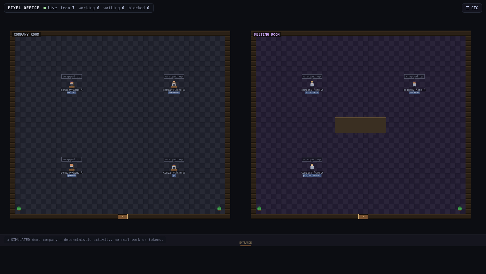
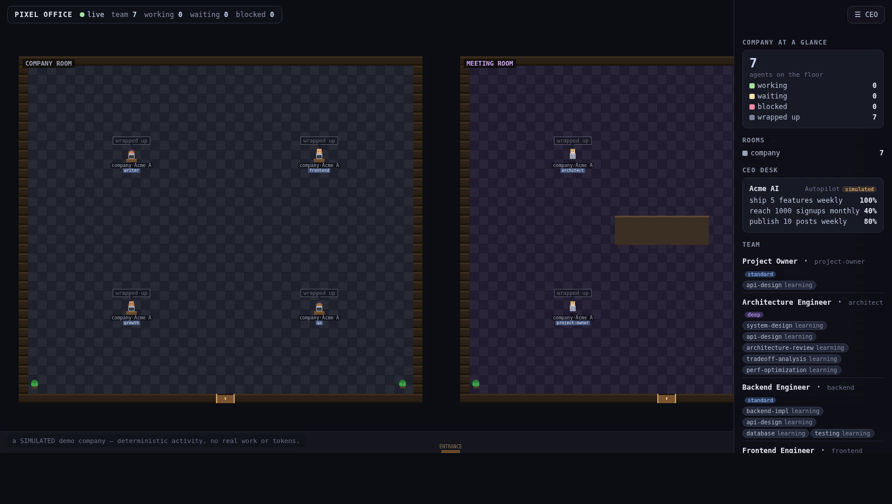
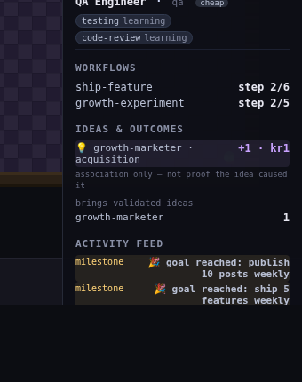
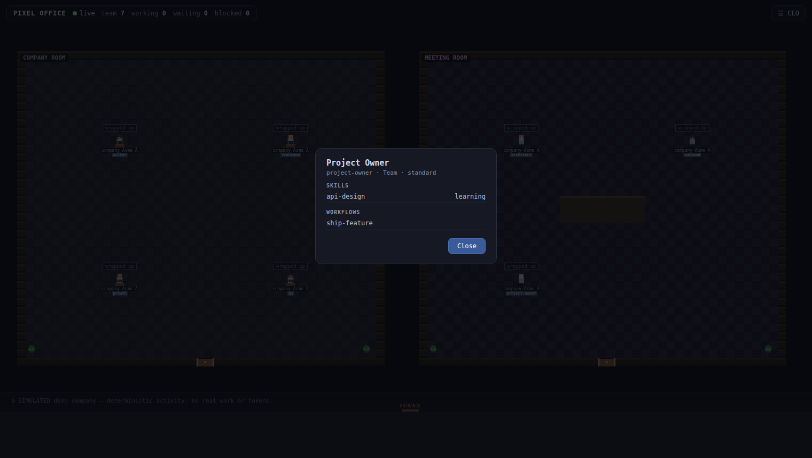

# Pixel Office

**Spin up an AI company you can *watch*.**

Pixel Office turns your AI coding CLIs into a live, game-like office. Scaffold a
little AI company, give it a goal, and watch **avatars** walk into their team rooms,
pick up work, hold meetings, and ship — every move driven by *real* telemetry, never
faked.



## See it in 10 seconds

```bash
pip install -e ".[web]"
po demo                    # → http://127.0.0.1:7717  — a full simulated company, instantly
```

`po demo` boots a sample 7-person company ("Acme AI") and runs it on autopilot so you
can see the whole thing move — roles, skills, meetings, OKRs climbing — with **zero
setup and zero tokens**. It's explicitly *simulated* (labelled as such everywhere), so
it's the fastest way to understand what Pixel Office is.

## Two ways to run it

**Watch mode — your real CLI sessions.** Every running agent, subagent, and LLM call
shows up as an avatar that moves between rooms and shows what it's doing (Claude Code,
Codex, and Grok today; more via one-file adapters — see [`docs/CLI-MATRIX.md`](docs/CLI-MATRIX.md)).

```bash
po up                      # watch all active CLI sessions as avatars
po hooks install           # opt-in: live per-event updates + waiting/subagent avatars
PO_OVERLAY=off po up       # headless core: a plain status table, no game layer
```

**Company mode — an AI company with a goal.** Scaffold an instrumented project from a
short conversation, then run it as a company that plans, routes work to the right role,
runs workflows, and moves its OKRs from *real* product metrics.

```bash
po new                     # scaffold an instrumented project (conversational)
po run --demo              # run it with simulated activity (0 tokens) — see it move
po run --live              # run it for real: employees use your CLIs and SPEND TOKENS
```

## The Company Layer

Under the game is a real operating model — so a scaffolded company actually knows *how*
to run a service, not just how to look busy.



- **A built-in role library** — Project Owner, a high-performance Architecture Engineer
  (deep tier), Backend / Frontend / QA / DevOps / PM / Designer / Writer / Growth / Data.
  Each hire carries a **persona**, a **model tier**, explicit **skills**, and the
  **workflows** it can run.
- **Reusable workflows** — ship-feature (spec → architecture → implement → test →
  review → deploy), content-pipeline, architecture-review, growth-experiment,
  incident-response. Steps advance **one at a time, only on a real success** — a failed
  or refused step halts the run; it is never skipped.
- **Skill-aware routing** — work goes to the best-fit role, tie-broken by *proven*
  competency, not seniority.
- **Meetings that earn their cost** — the company only pulls the team into the meeting
  room when a decision genuinely can't be resolved async (a blocked workflow, or
  competing stalled goals) — not on a timer.
- **A growth loop** — point the company at your live product's KPI endpoints and its
  OKRs move from metrics it *actually* reads. No product URL → the goals honestly stay
  at 0% until real numbers land.
- **Evidence-based individuality** — each employee has a private memory. A "focus" or a
  competency score only appears once the work *proves* it; below the evidence floor it
  reads **"learning"** rather than inventing a number.
- **Ideas that have to *work*** — employees propose creative ideas (real-CLI-written in
  `--live`), each aimed at a specific Key Result. An idea earns standing for its author
  **only if it ships and the targeted KR actually rises afterward** — and even then it's
  labelled *"association only, not proof the idea caused it."* No points for a
  good-sounding pitch; creativity is pointed at real outcomes, not theater.



Click any employee to open their profile — their role, tier, skills (with real
proficiency or "learning"), focus, and active workflows:



Full details: [`docs/COMPANY-LAYER.md`](docs/COMPANY-LAYER.md).

## Honest by design

This is the invariant the whole project is built on:

- **Avatars never fake activity** — an avatar only moves when something real happens.
- **Work only counts when it succeeded** — a CLI that refuses or errors does not advance
  a workflow or earn competency, even though it produced text.
- **No invented metrics or personality** — competency and traits are `None` below the
  evidence floor; the demo's simulated progress is labelled `simulated` everywhere so
  it's never confused with real work.
- **Local-first, no tokens stored** — runs on your machine; each CLI keeps its own login
  (subscription **or** API key). Telemetry fails **open**; privileged actions fail **closed**.
- **Light enough for a weak laptop** — the game layer is optional (`PO_OVERLAY=off`).

## Documentation

| Doc | What it covers |
|---|---|
| [`docs/COMPANY-LAYER.md`](docs/COMPANY-LAYER.md) | Roles, skills, workflows, meetings, the growth loop, and the honesty model |
| [`docs/ARCHITECTURE.md`](docs/ARCHITECTURE.md) | The core/overlay split and the telemetry pipeline |
| [`docs/CLI-MATRIX.md`](docs/CLI-MATRIX.md) | Which CLIs are supported and how to add one |
| [`docs/TELEMETRY-CONTRACT.md`](docs/TELEMETRY-CONTRACT.md) | The event/identity contract (frozen before any dashboard code) |
| [`docs/DECISIONS.md`](docs/DECISIONS.md) | Locked decisions and their rationale |
| [`ROADMAP.md`](ROADMAP.md) | Dependency-ordered build plan |

Run the tests with `pip install -e ".[dev]" && pytest -q`. The design was pressure-tested
through a multi-model deliberation (Claude, Codex, Grok); see `docs/DECISIONS.md`.

## License

MIT — see [`LICENSE`](LICENSE).
